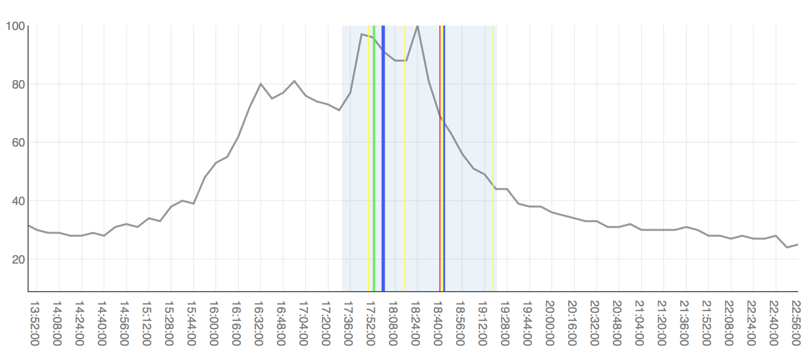

# Senior Thesis - EPL Analytics

Understanding how various match events in the English Premier League and affect normalized search activity, and applying the conclusions to effectively "surge price" certain advertisements before, during, and after matches.

## Tools

* [pytrends](https://github.com/GeneralMills/pytrends) - Gather normalized search activity data
* [kaggle](https://www.kaggle.com/hugomathien/soccer/version/6) - Gather match events and associated metadata
* [sqlite3](https://docs.python.org/3/library/sqlite3.html) -  Integrate SQL operations with API requests
* [plot.ly / dash](https://plot.ly/dash/) - Create interactive data visualization website 

## White Paper

Coming Soon.

## Interactive Visualizations
Interactive Coming Soon.
Sample: Chelsea / Swansea, 08.08.2015

## Authors

* **Naman Gupta** - *Student* - [University of Michigan](http://namangupta.co)
* **Dr. Eric Schwartz (Advisor)** - *Professor* - [Ross School of Business, Marketing](https://michiganross.umich.edu/faculty-research/faculty/eric-schwartz)

## Acknowledgement

* **Stefan Szymanski** - *Author* - [Soccernomics](http://ns.umich.edu/new/experts-list/23907-stefan-szymanski-ph-d)
